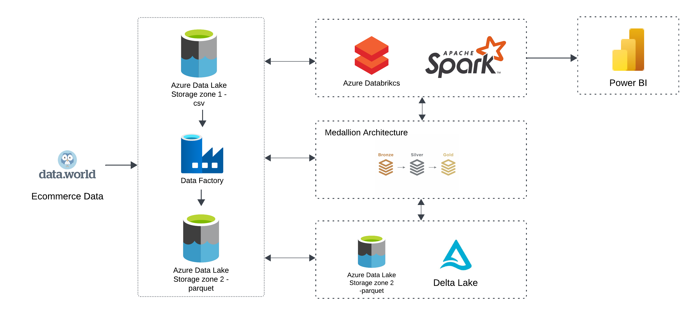
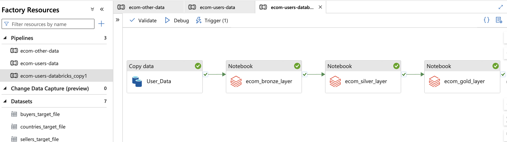

# E-commerce Data Engineering Pipeline using Apache Spark on Databricks with Azure Cloud

## Project Overview
This project showcases the creation of an automated data engineering pipeline to process large datasets using Apache Spark on the Azure Databricks platform. The pipeline extracts, transforms, and loads data from Azure Data Lake Storage (ADLS) and builds dashboards to extract actionable business insights.

---

## Architecture Diagram

---

## Tools and Technologies Used
- **Apache Spark**
- **Azure Databricks**
- **Azure Data Factory**
- **Azure Data Lake Storage**

---

## Azure Services Overview
### Azure Data Lake Storage (ADLS)
ADLS is a highly scalable and secure data storage service optimized for big data analytics. It supports the hierarchical namespace and allows storage of large volumes of structured and unstructured data, making it ideal for big data scenarios.

### Azure Data Factory (ADF)
ADF is a fully managed cloud-based ETL service that orchestrates and automates data workflows across various data sources, including ADLS. It enables efficient data movement and transformation at scale, making data available for analytics and insights.

### Azure Databricks
Azure Databricks is an Apache Spark-based analytics platform that integrates seamlessly with Azure services. It provides a collaborative environment for data engineering, machine learning, and big data analytics. It reads and processes data from ADLS, enabling efficient transformations and analyses.

---

## Dataset
The dataset used in this project pertains to an e-commerce fashion business operating globally.  
**Dataset Link**: [E-commerce Users of a French C2C Fashion Store](https://data.world/jfreex/e-commerce-users-of-a-french-c2c-fashion-store)

### Dataset Breakdown
- **Users**: This dataset is dynamic and frequently updated.
- **Buyers, Countries, Sellers**: These datasets are relatively static and follow the Slowly Changing Dimensions concept.
- **Chunking Users Data**: 
  - Due to the large size of the Users dataset, it is divided into 10 smaller chunks for ease of processing.
  - Refer to `users_chunk_data.ipynb` for the chunking logic, and find the chunked data in the `chunked_data/` directory.

---

## Data Factory Pipelines
### Overview
The pipelines in ADF handle the movement and transformation of data between ADLS containers and Databricks.

### Pipeline Details
1. **Static Data Pipeline**:
   - Moves and transforms `buyers`, `countries`, and `sellers` data from `landing-zone-1` to `landing-zone-2`.
   - Converts CSV files into Parquet format.
   - As these datasets are rarely updated, they are processed only once.  
   

2. **Dynamic Users Data Pipeline**:
   - Handles the frequently updated Users dataset.
   - Automatically triggers when a new file is uploaded to `landing-zone-1`.
   - Converts Users data to Parquet format and moves it to `landing-zone-2`.  
   

---

## Azure Data Factory and Databricks Integration
- **Linked Service**: A linked service is created to establish a connection between ADF and Azure Databricks.
- **Authentication**: 
  - Use the `Access Token` method to authenticate. Generate the token in Databricks under `Settings > Developer > Access Tokens`.
- **Cluster Selection**: 
  - Choose `Existing Interactive Cluster` to utilize an already created cluster for free-tier accounts.
  

### Pipeline Execution
- Manually upload the Users CSV file to `landing-zone-1` to trigger the pipeline.
- Users data is processed in `to_process/` directory and moved to `processed/` after transformation.

---

## Data Transformation Using Medallion Architecture
The data transformation process follows the Medallion Architecture with three layers:
1. **Bronze Layer**: Raw data ingestion.
2. **Silver Layer**: Cleaned and enriched data.
3. **Gold Layer**: Final transformed data ready for analytics.

- The gold layer merges `users`, `buyers`, `countries`, and `sellers` data into a single comprehensive table.

---

## Analytics and Dashboard Creation
1. Create a table using the final merged data for analytics.
2. Run analytical queries to derive insights. Refer to `Analytics_query.sql` for sample queries.
3. Visualize insights through dashboards built using Azure Databricks.

---

## Project Files and Structure
- **`chunked_data/`**: Contains the chunked Users data.
- **`users_chunk_data.ipynb`**: Jupyter notebook for chunking Users data.
- **`ecom_gold_layer.ipynb`**: Notebook handling data transformation and merging.
- **`Analytics_query.sql`**: SQL file containing analytical queries.
- **`README.md`**: This documentation.

---

## Conclusion
This project demonstrates an end-to-end data engineering pipeline for processing and analyzing e-commerce data using Azure and Apache Spark technologies. It highlights how to automate data workflows and generate business insights efficiently.
