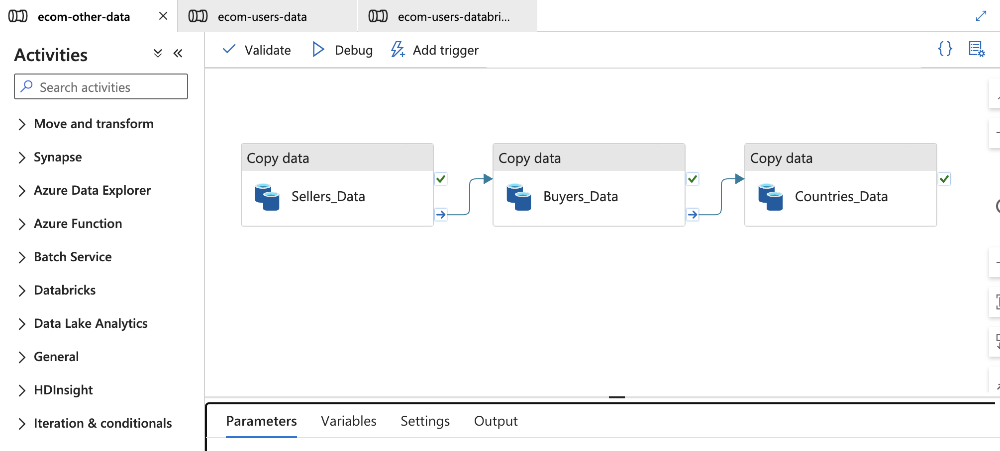
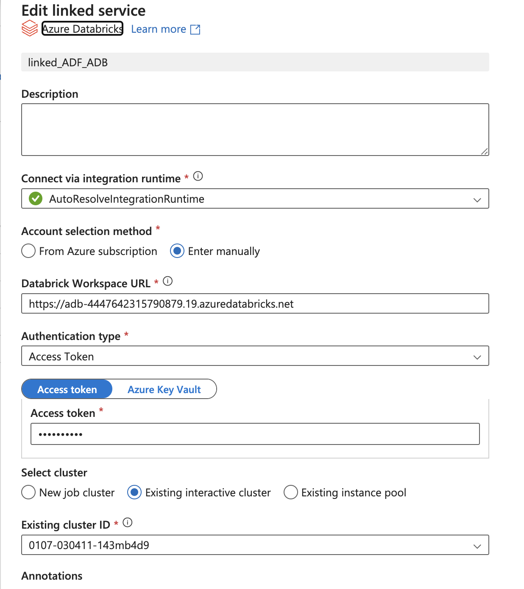

# Ecom data Data Engineering pipeline using Apache Spark on Databricks with Azure Cloud

Project Overview:
This project delves in dealing with large dataset and processes using Apache Spark with the help of Azure Databricks platform to extract useful business insights. An automated pipleine was built from extracting the dataset from ADLS to building dashboards using Azure Databricks.

Tools Used:
- Apache Spark
- Databricks
- Azure Databricks
- Azure Data Factory
- Azure Data Lake Storage

Azure servicese used: Azure Data Lake Storage: It is a highly scalable and secure data storage service built for big data analytics, providing hierarchical namespace and optimized for Azure-based data processing and analytics workloads. It allows storage of large volumes of structured and unstructured data for big data scenarios.

Azure Data Factory: It is a fully managed cloud-based ETL service that enables you to orchestrate and automate data workflows across different data sources, including ADLS, databases, and cloud storage. It is used to move and transform data at scale, making it available for analytics and business insights.

Azure Databricks: It is an Apache Spark-based analytics platform that integrates with Azure services to offer a collaborative environment for data engineering, machine learning, and big data analytics. It can read and process data from ADLS, transforming and analyzing large datasets efficiently and collaboratively.

Dataset:
The dataset contains ecommerce data about fashion business operated accross the globe. 
The dataset is available at: https://data.world/jfreex/e-commerce-users-of-a-french-c2c-fashion-store

Chunking the data:
- The dataset contains users, buyers, countries, sellers, and data.
- Among all of the categories users is the only data that gets changed, and rest all of the data remains same.
- The users data is keep on generating based on newly added users, and the rest of the data rarely changes based on slowly chnaging dimesion concept.
- The users data is huge and therfore chunked the data into 10 chunked datasets. Refer `users_chunk_data.ipynb` which has the code to chunk users data, and chunked data can be found at `chunked_data/`
- The users data is chunked for the ease of processing.

Data Factory pipeline:
- A pipeline is created in Data Factory by going to the path `Author > Pipelines > Move and transform > Copy data`
- Created two pipelines, first pipeline is to load buyers, coutries, and sellers csv data from landing-zone-1 container to landing-zone-2 container after converting into parquet file.
- As limited with the resources, I manually load csv files into landing-zone-1 container, and from their Data Factory pipeline picks the files and automatically load into landing-zone-2
- buyers, countries, and sellers data is enough to be loaded once as the data mostly don't change. So a different pipeline was created to laod thier data into landing-zone-2 by converting into parquet format.
  
- users data is keep on generating, so it's conversion into parquet format and loads into landing-zone-2 is done by other pipeline. A trigger is added to this pipeline when a blob is created in landing-zone-1.
 
- Before creating the databricks notebooks, create a linked service to establish connection between Data Factory and Azure Databricks.
- While creating the linked service, select Access token as Authentication service. Generate access token in Azure databricks by navigating `Settings > Developer > Access tokens`
- Select `Existing interactive cluster` and attach the cluster that was created in databricks. If `New job cluster` is selected, free tier's don't have the privilege to generate a new cluster. So go with existing cluster that was created.
- Follow as shown in the screenshot.
  
- Once everything is set up, validate and publish the changes. Manually place a users csv file in landing-zone-1, this triggers the `User_Data` Copy data stage and then serially executes the Databricks notebooks.
- In landing-zone-2 two directories were created `to_process/`, and `processed/`. Once converted parquet file got processed through the pipeline, the users parquet file is moved to `processed/` folder and then gets deleted in `to_process/` directory. This code is handled in `ecom_gold_layer.ipynb`
- The transformations of the data in the databricks notebooks is done according to the medallion architecture by following bronze, silver, and gold layers.
- Gold layer has the final transformed data. Merge users, buyers, countries, and sellers data into one big table.
- Create a table using the one big table, which helps for analytics.
- Run analytics on the table, some of the anlaytics can be found in `Analytics_query.sql`
- Create a dashboard using the analytic queries.

